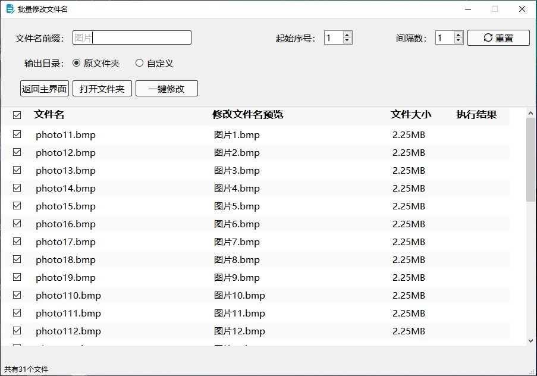
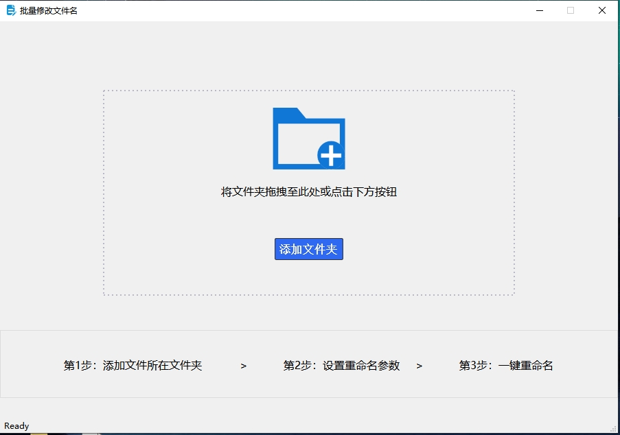
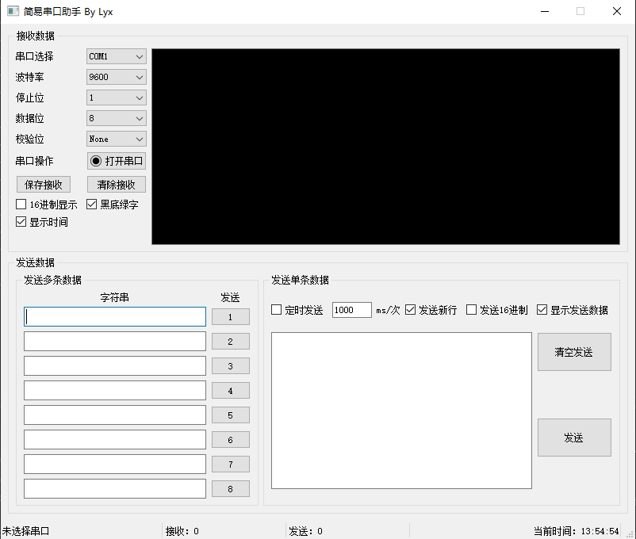

# QT Project

### 存放一些QT小项目，QT版本5.12.12

1. rename：批量重命名

      

      

2. serial_port：简易串口助手

      

3. notebook：记事本，实现了以下功能：

      - 打开、保存、关闭文件
      - 快捷键：`CTRL+O`打开文件，`CTRL+S`保存文件
      - 利用事件实现：`CTRL+加号`放大字体，`CTRL+减号`缩小字体
      - 读取文件自动识别文本的编码，保存文件可切换文件保存的编码
      - 高亮光标所在的行，并且显示光标所在的行和列

